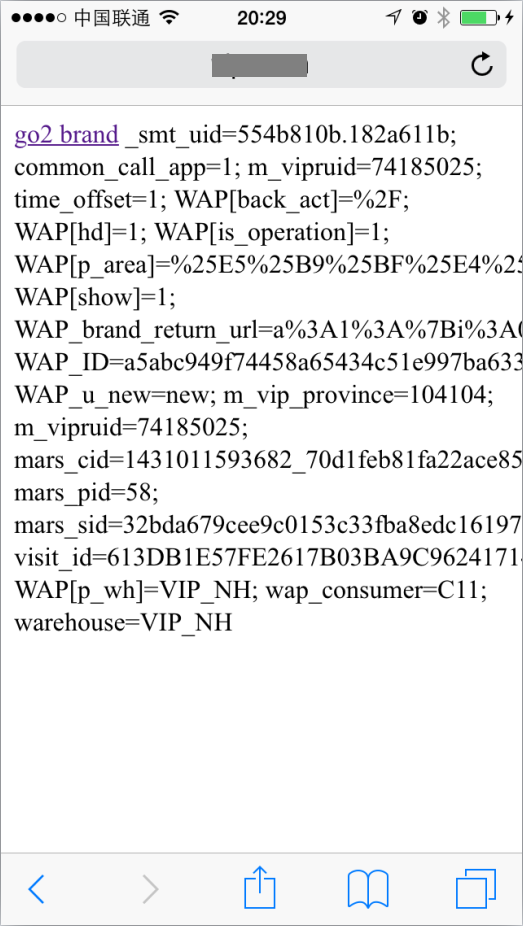

# 关于iOS safari私有属性的一些tips

在iOS平台的safari浏览器，可以将当前浏览的页面发送到桌面，桌面就多了一个icon，这样看起来就像是一个原生应用一样，用户体验还是挺赞的。

基于以上是背景，笔者接到一个产品需求，将wap站点发送到桌面，让用户可以从桌面启动。按理说这是一个很简单的需求，5min就能搞定了，可是在实时的过程中出现了问题——从桌面启动之后cookie怎么也和浏览器打开的对不上，cookie直接决定了用户能看到什么内容。

于是对apple的几个私有属性进行了研究，首先是`apple-touch-icon`，默认情况下，点击发送到桌面时会生成页面的截图作为桌面显示的icon，可以通过添加这样的代码定制icon：

``` xml
<link rel="apple-touch-icon" href="touch-icon-iphone.png">
<link rel="apple-touch-icon" sizes="76x76" href="touch-icon-ipad.png">
<link rel="apple-touch-icon" sizes="120x120" href="touch-icon-iphone-retina.png">
<link rel="apple-touch-icon" sizes="152x152" href="touch-icon-ipad-retina.png">
```

其中默认的尺寸是60x60，浏览器会一次查找各个尺寸的icon图，没有就生成页面截图。

研究的过程中发现，页面载入时这些icon图片并不会加载，只有在用户点击发送到桌面按钮时才发送。

所以我们一开始想通过定制这条icon请求来达到cookie同步的问题，代码如下：

``` xml
<link rel="apple-touch-icon" href="/appleicon.php">
```

拦截icon请求然后把带上去的cookie原样写回到根域，再返回一张图片。但后来发现这个方法行不通，cookie还是对不上，而且是一些莫名其妙的值。

正在笔者打算放弃的时候，做了个空白页（benchmark）测试，代码如下：

``` xml
<!DOCTYPE html>
<html lang="en">
    <head>
        <meta charset="utf-8">
        <title>test app</title>
        <meta content="yes" name="apple-mobile-web-app-capable">
        <meta name="viewport" content="width=device-width, initial-scale=1.0, maximum-scale=1.0, user-scalable=0">
        <link href="120.png" rel="apple-touch-icon" />
    </head>
    <body>
    <a href="brand-416186-0-0-0-1-0-1-20.html" class="u-brand-pic J_item-list">go2 brand</a>
    <script type="text/javascript">document.write(document.cookie);</script>
    </body>
</html>
```

浏览器截图：



发送到桌面打开后奇迹出现了，看到的cookie和safari一样！！

细心检查之后发现其实测试代码少了一个东东，也就是最关键所在：
``` xml
<meta content="yes" name="apple-mobile-web-app-capable">
```

再加上这个meta标签之后，从桌面启动看到这样：


整个页面是全屏的，导航条和地址栏都没了，看起来更像是原生app，但是cookie莫名其妙的变了！！

然后去查了苹果[官网说明](https://developer.apple.com/library/safari/documentation/AppleApplications/Reference/SafariHTMLRef/Articles/MetaTags.html)：

> Discussion
If content is set to yes, the web application runs in full-screen mode; otherwise, it does not. The default behavior is to use Safari to display web content.
You can determine whether a webpage is displayed in full-screen mode using the window.navigator.standalone read-only Boolean JavaScript property.

意思是说，设置成`yes`之后，将开启全屏模式，否则将和safari打开一样，全屏模式下js将多出一个只读的属性`window.navigator.standalone`。

问题查了一条，但就这么easy地解决了，但是全屏模式下cookie的问题还是想不通。
